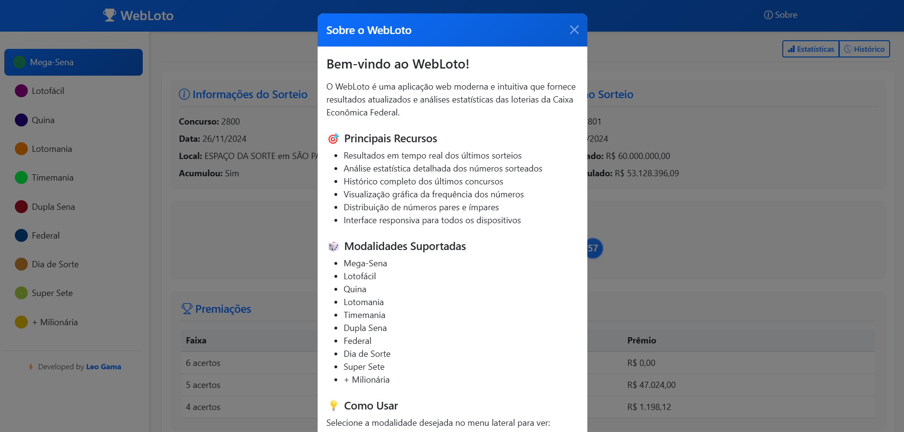
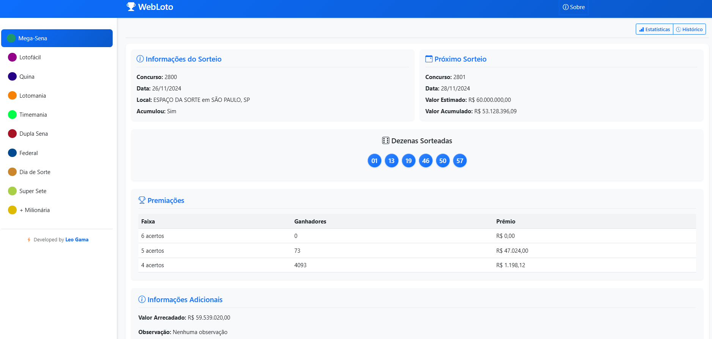
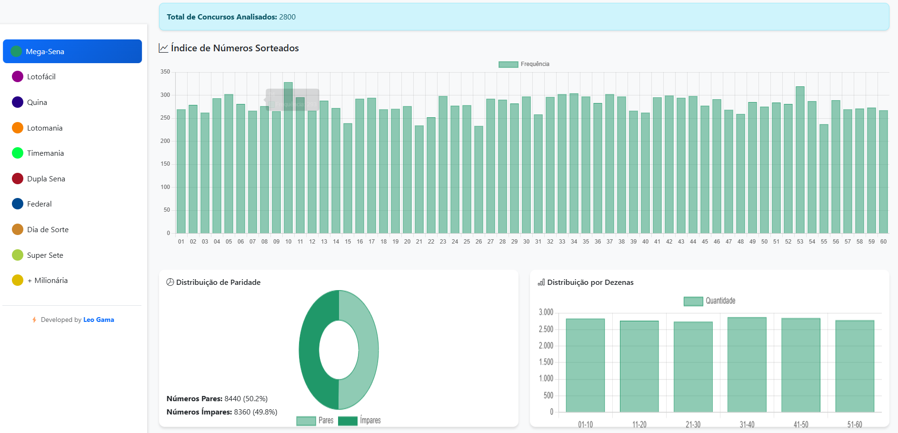
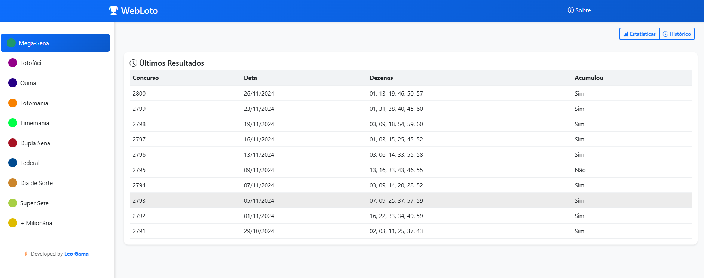

# 🎲 WebLoto - Análise de Resultados das Loterias

WebLoto é uma aplicação web moderna e intuitiva que fornece resultados atualizados e análises estatísticas das loterias da Caixa Econômica Federal. Com uma interface responsiva e amigável, oferece visualizações detalhadas e insights sobre os resultados dos sorteios.

## ✨ Funcionalidades

- 🔄 **Resultados em Tempo Real**: Acompanhe os últimos resultados de todas as modalidades
- 📊 **Análise Estatística**: Visualize gráficos e tendências dos números sorteados
- 📜 **Histórico Completo**: Acesse o histórico dos últimos concursos
- 📱 **Design Responsivo**: Interface adaptável para todos os dispositivos
- 🎯 **Multi-Modalidades**: Suporte para todas as principais loterias

## 🎲 Modalidades Suportadas

- Mega-Sena
- Lotofácil
- Quina
- Lotomania
- Timemania
- Dupla Sena
- Federal
- Dia de Sorte
- Super Sete
- +Milionária

## 🚀 Recursos Principais

### Visualização de Resultados
- Números sorteados com design intuitivo
- Valores de premiação detalhados
- Informações sobre acumulados
- Data e local dos sorteios

### Análise Estatística
- Gráficos de frequência dos números
- Distribuição de números pares e ímpares
- Análise por dezenas e intervalos
- Tendências históricas

### Interface Moderna
- Design clean e intuitivo
- Navegação simplificada
- Carregamento dinâmico de conteúdo
- Feedback visual das ações

## 🛠️ Tecnologias Utilizadas

- **Backend**: Python com Flask
- **Frontend**: JavaScript Vanilla, HTML5, CSS3
- **Visualização**: Chart.js
- **Estilo**: Bootstrap 5
- **API**: Integração com API oficial das Loterias

## 📦 Instalação

1. Clone o repositório:

2. Instale as dependências:
\`\`\`bash
pip install -r requirements.txt
\`\`\`

3. Execute a aplicação:
\`\`\`bash
python app.py
\`\`\`

4. Acesse no navegador:
\`\`\`
http://localhost:5000
\`\`\`

## 💻 Requisitos do Sistema

- Python 3.x
- Navegador web moderno
- Conexão com internet

## 🔄 Atualizações

Os resultados são atualizados automaticamente após cada sorteio através da API oficial das Loterias da Caixa.

## 🤝 Contribuições

Contribuições são bem-vindas! Sinta-se à vontade para:

1. Fazer um Fork do projeto
2. Criar uma branch para sua feature (\`git checkout -b feature/AmazingFeature\`)
3. Commit suas mudanças (\`git commit -m 'Add some AmazingFeature'\`)
4. Push para a branch (\`git push origin feature/AmazingFeature\`)
5. Abrir um Pull Request

## 👤 Author

⚡ Desenvolvido por Leo Gama
- GitHub: [@LeoGamaJ](https://github.com/LeoGamaJ)
- Email: leo@leogama.cloud 
- LinkedIn: [leonardo-gama-jardim](https://www.linkedin.com/in/leonardo-gama-jardim/)

## 📝 Licença

Este projeto está sob a licença MIT.
